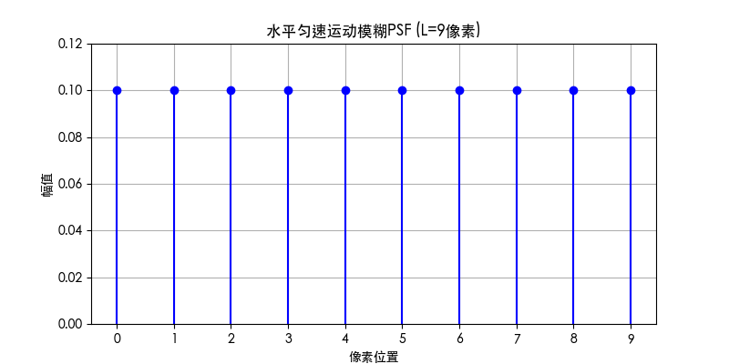
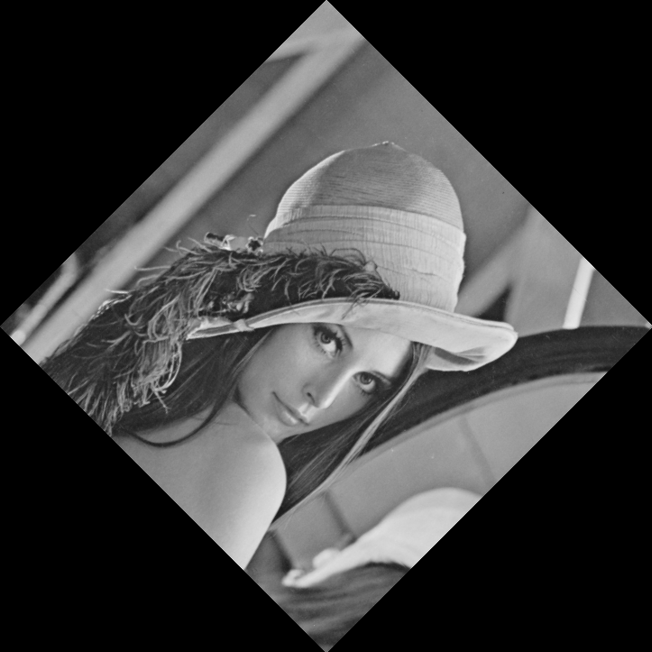

# 第五章作业

### 1. 写出逆滤波和维纳滤波图象恢复的具体步骤。

**一、逆滤波**

1. **频域转换**：  
   对退化后的图像 \( g(x, y) \) 进行二维离散傅里叶变换（DFT），得到频域表示 \( G(u, v) \)。  
   \[
   G(u, v) = \mathcal{F}\{g(x, y)\}
   \]  
   （可选：对图像进行零填充或乘以 \((-1)^{x+y}\) 以中心化频谱。）

2. **退化函数建模**：  
   确定退化过程的点扩散函数（PSF）对应的频域传递函数 \( H(u, v) \)。例如：  
   - 运动模糊：\( H(u, v) = \frac{\sin(\pi a u)}{N \sin(\pi u/N)} e^{-j\pi a u} \)。  
   - 散焦模糊：\( H(u, v) = \text{sinc}(u, v) \)。

3. **逆滤波计算**：  
   在频域中直接对退化函数求逆，计算原始图像的估计频谱 \( \hat{F}(u, v) \)：  
   \[
   \hat{F}(u, v) = \frac{G(u, v)}{H(u, v)}
   \]  
   **注意事项**：  
   - 当 \( |H(u, v)| \) 接近零时，噪声会被严重放大。  
   - 可通过阈值处理限制噪声，例如：  
     \[
     \hat{F}(u, v) = \begin{cases}
     \frac{G(u, v)}{H(u, v)}, & |H(u, v)| \geq \epsilon \\
     0, & \text{otherwise}
     \end{cases}
     \]  
     （其中 \( \epsilon \) 为预设的最小阈值。）

4. **逆傅里叶变换**：  
   对 \( \hat{F}(u, v) \) 进行逆傅里叶变换，得到恢复的时域图像 \( \hat{f}(x, y) \)：  
   \[
   \hat{f}(x, y) = \mathcal{F}^{-1}\{\hat{F}(u, v)\}
   \]

**二、维纳滤波（Wiener Filtering）**
1. **频域转换**：  
   对退化图像 \( g(x, y) \) 进行傅里叶变换，得到 \( G(u, v) \)，步骤同逆滤波第一步。

2. **退化函数与噪声建模**：  
   - 确定退化函数 \( H(u, v) \)。  
   - 估计噪声功率谱 \( S_n(u, v) \) 和原始图像功率谱 \( S_f(u, v) \)。  
     （若未知，可假设为白噪声且图像功率谱平坦，用常数 \( K = \frac{S_n}{S_f} \) 近似。）

3. **构造维纳滤波器**：  
   设计频域滤波器 \( W(u, v) \)：  
   \[
   W(u, v) = \frac{H^*(u, v)}{|H(u, v)|^2 + \frac{S_n(u, v)}{S_f(u, v)}}
   \]  
   （其中 \( H^* \) 为 \( H \) 的复共轭；若使用简化模型，则 \( W(u, v) = \frac{H^*(u, v)}{|H(u, v)|^2 + K} \)。）

4. **频域滤波**：  
   将滤波器作用于退化图像的频谱：  
   \[
   \hat{F}(u, v) = W(u, v) \cdot G(u, v)
   \]

5. **逆傅里叶变换**：  
   对 \( \hat{F}(u, v) \) 进行逆傅里叶变换，得到恢复图像 \( \hat{f}(x, y) \)。

---

### 2. 推导水平匀速直线运动模糊的点扩展函数的数学公式并画出曲线。

假设在曝光时间 \( T \) 内，图像传感器与场景在水平方向发生匀速直线运动，移动总距离为 \( L \) 个像素。此时，每个点的光强会在运动路径上均匀累积，形成矩形波形的模糊。

- 离散化的点扩展函数（PSF）可表示为：

\[
h(x) = 
\begin{cases} 
\frac{1}{L+1}, & x = 0, 1, 2, \dots, L \\
0, & \text{其他}
\end{cases}
\]

- 连续情况下，PSF是矩形函数 \( \text{rect}(x/L) \)。

曲线如下所示:



**曲线说明**
- **横轴**：像素位置，覆盖 \( 0 \) 到 \( L \)。
- **纵轴**：PSF的幅值，每个位置均为 \( \frac{1}{L+1} \)。
- 曲线形状为均匀分布的离散脉冲序列，总面积为1。

---

### 3. 编程实现lema.bmp的任意角旋转。

核心代码如下：

```Python
# 获取四个角点旋转后的坐标
    corners = np.array([
        [0, 0],
        [w-1, 0],
        [0, h-1],
        [w-1, h-1]
    ])

# 计算旋转后的坐标
    cx, cy = w/2, h/2  # 原图中心
    rotated_corners = []
    for x, y in corners:
        # 平移坐标系到中心点
        x_rel = x - cx
        y_rel = y - cy
        # 应用旋转矩阵
        x_rot = x_rel * cos_theta - y_rel * sin_theta
        y_rot = x_rel * sin_theta + y_rel * cos_theta
        # 移回原坐标系
        rotated_corners.append([x_rot + cx, y_rot + cy])

# 遍历新图像的每个像素
    for y_new in range(new_h):
        for x_new in range(new_w):
            # 将新坐标转换到原图坐标系
            # 平移坐标系到新中心
            x_rel = x_new - new_cx
            y_rel = y_new - new_cy
            # 应用逆向旋转矩阵
            x_ori = x_rel * cos_theta + y_rel * sin_theta
            y_ori = -x_rel * sin_theta + y_rel * cos_theta
            # 移回原图坐标系
            x_ori += cx
            y_ori += cy

            # 检查是否在原图范围内
            if 0 <= x_ori < w and 0 <= y_ori < h:
                # 双线性插值
                x0 = int(math.floor(x_ori))
                y0 = int(math.floor(y_ori))
                x1 = min(x0 + 1, w - 1)
                y1 = min(y0 + 1, h - 1)

                # 计算权重
                dx = x_ori - x0
                dy = y_ori - y0

                # 获取四个相邻像素值
                val = (1 - dx) * (1 - dy) * img_array[y0, x0] + \
                      dx * (1 - dy) * img_array[y0, x1] + \
                      (1 - dx) * dy * img_array[y1, x0] + \
                      dx * dy * img_array[y1, x1]

                rotated_img[y_new, x_new] = int(val)
```

得到 `lena.bmp` 旋转 \(45^{\circ}\) 后的结果如下图:

