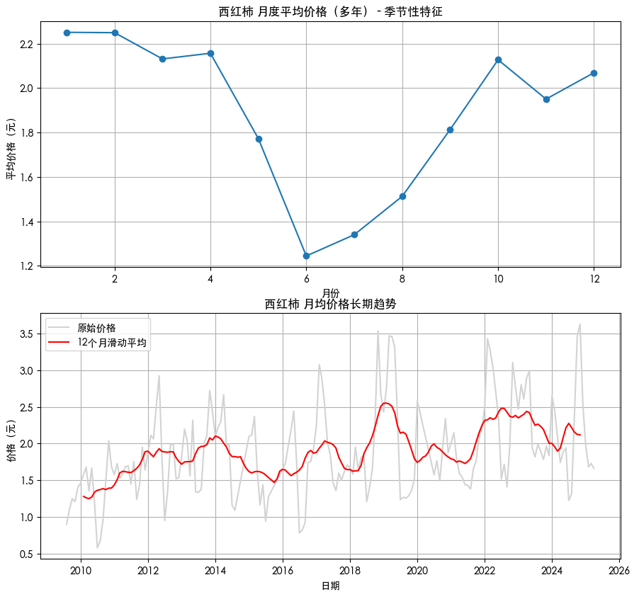
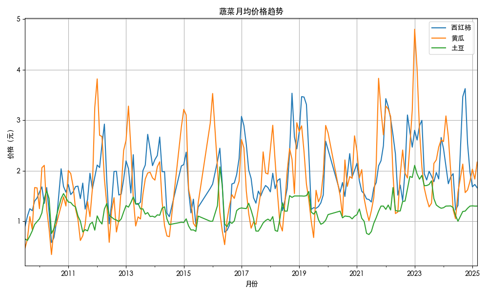
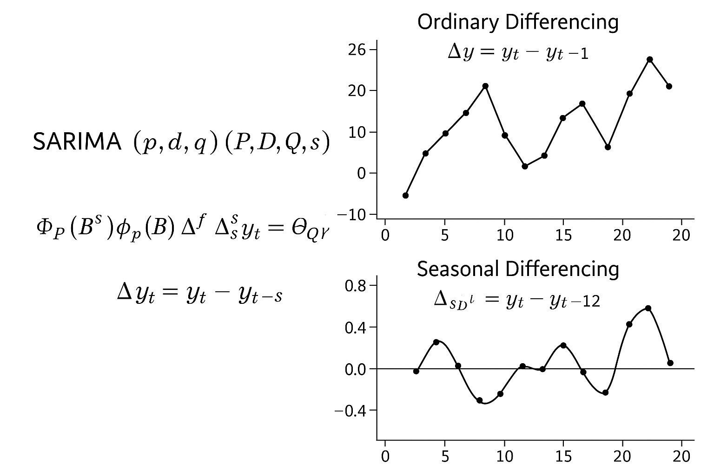
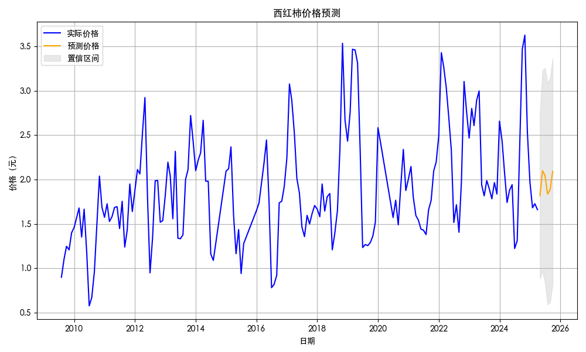
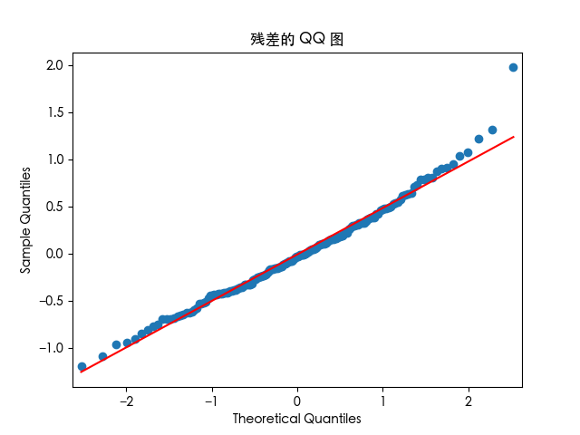

# 模型建立与分析报告：蔬菜价格的季节性变化与长期趋势

## 一、实验目的

根据中国科技大学食品服务集团公布的蔬菜价格数据（来自 [https://ysjt.ustc.edu.cn/wjxx/list.htm），分析蔬菜价格随季节的变化情况以及长期趋势，并构建数学模型进行预测与验证。](https://ysjt.ustc.edu.cn/wjxx/list.htm），分析蔬菜价格随季节的变化情况以及长期趋势，并构建数学模型进行预测与验证。)

## 二、数据预处理

原始数据以 JSON 格式存储，其中每条记录包括一个日期字符串和一个当日蔬菜价格字典。首先我们将其结构化为标准的三列格式：**日期（date）、蔬菜名称（vegetable）、价格（price）**，并转换为 Pandas DataFrame 以便进一步处理。

为了进行时间序列建模，我们以日期为索引，按“蔬菜名称”列透视表格（pivot），形成“每种蔬菜的每日价格时间序列”。由于价格记录中存在部分缺失（某些日期未涵盖全部蔬菜种类），我们采用 **前向填充法（forward fill）** 和 **线性插值（interpolate）** 两种方式分别用于：

* **短期缺失填补**：例如节假日暂停供货，前后价格连续；
* **构建平滑的趋势序列**：用于模型训练和可视化时避免不连续。

此外，为了观察长期和季节性趋势，我们将每日价格序列按月进行重采样（`resample('M')`），取月平均值，得到更稳定的月度时间序列。这些序列将作为后续季节性建模和趋势分析的基础。

## 三、季节性分析与长期趋势分析

**以西红柿为例：**

### 季节性分析（上图）

* **方法**：将多个年份的价格按月份汇总，计算每月的**多年平均价格**。
* **观察结果**：

  * 价格在 **夏季（5月\~7月）明显偏低**，对应西红柿大量上市；
  * 在 **冬季（11月\~2月）价格升高**，与供应减少、温室种植成本增加相关。
* 结论：存在**稳定且显著的年周期性季节效应**，为使用 **SARIMA 的季节性建模**提供了理论基础。

---

### 长期趋势分析（下图）

* **方法**：对月度平均价格进行**12个月滑动平均**平滑处理，提取长期趋势。

* **观察结果**：

  * 整体趋势呈**缓慢上升**，反映出通货膨胀、生产成本上升等长期效应；
  * 波动被平滑后更加清晰地区分出“波段变化”。

* 结论：西红柿价格不仅具有季节性特征，也呈现出**缓慢的长期上涨趋势**，符合农业价格随时间逐步上涨的经济预期。

---

同样的做出西红柿、黄瓜、土豆的价格趋势图:

价格变化呈现和西红柿类似的变化，因此决定采用 **SARIMA 季节性时间序列模型**。

## 四、数学模型构建与预测

为刻画西红柿价格的时间序列变化趋势，我们选用**季节性自回归移动平均整合模型**（Seasonal ARIMA，简称 SARIMA）进行拟合建模。

SARIMA 模型可以理解为一个多层叠加的结构，它的目标是**利用历史数据中“自身的滞后值”和“误差的滞后值”来预测当前值**，同时兼顾季节性变化。

$$
\Phi_P(B^s)\phi_p(B)\Delta^d\Delta_s^D y_t = \Theta_Q(B^s)\theta_q(B)\varepsilon_t
$$

这个公式可以拆解为几部分：

| 符号部分            | 含义              | 通俗解释              |
| --------------- | --------------- | ----------------- |
| $y_t$           | 当前时间点的价格        | 我们要预测的值           |
| $\phi_p(B)$     | AR(p)：非季节性自回归项  | 当前价格受前几期“自身价格”影响  |
| $\theta_q(B)$   | MA(q)：非季节性滑动平均项 | 当前价格受前几期“误差”的影响   |
| $\Phi_P(B^s)$   | 季节性自回归          | 当前价格受“上一年同月”的价格影响 |
| $\Theta_Q(B^s)$ | 季节性滑动平均         | 当前价格受“上一年同月的误差”影响 |
| $\Delta^d$      | 普通差分            | 去除整体上升或下降趋势       |
| $\Delta_s^D$    | 季节性差分           | 去除“每年重复出现”的周期性波动  |
| $\varepsilon_t$ | 白噪声误差项          | 模型无法解释的随机扰动       |

SARIMA 模型记作：

$$
SARIMA(p,d,q)(P,D,Q,s)
$$

其中：

* $(p,d,q)$ 为非季节部分的自回归（AR）、差分（I）、滑动平均（MA）阶数；
* $(P,D,Q)$ 为季节部分的 AR、I、MA；
* $s$ 表示季节周期，本数据中为**每年12个月**，因此 $s=12$。

---

**参数设置理由如下：**

| 参数         | 说明 |
| ---------- | ---------------------------------- |
| **p = 1**  | 近期价格对当前价格有一定的线性依赖（短期记忆），故设置一级自回归项 |    |
| **d = 1**  | 经初步观察，价格序列整体呈趋势变化，不稳定；差分一次后趋于平稳   |    |
| **q = 1**  | 剩余误差序列存在一定短期波动，需一级 MA 项吸收短期噪音     |    |
| **P = 1**  | 存在**年周期性**的滞后依赖，即当前月价格受上一年同月影响较大  |    |
| **D = 1**  | 存在**周期性趋势**（价格逐年波动），需做一次季节差分使其平稳  |    |
| **Q = 1**  | 周期误差项存在依赖性，引入一级季节 MA 项捕捉季节噪音效应    |    |
| **s = 12** | 数据为月度数据，周期为 12 个月，符合农业生产与市场供需节律   |    |

---

得到模型结果如下：

| 项目                     | 数值          |
| ---------------------- | ----------- |
| 变量（蔬菜）                 | 西红柿         |
| 样本数量                   | 174         |
| 日志似然值 (Log Likelihood) | -107.672    |
| AIC 值                  | **225.345** |
| BIC 值                  | 240.297     |
| HQIC 值                 | 231.420     |
| 协方差类型                  | opg         |

拟合诊断如下：

| 指标名称                   | 数值    |
| ---------------------- | ----- |
| Ljung-Box (L1) Q 统计量   | 6.00  |
| Q 的 p 值                | 0.01  |
| Jarque-Bera (JB) 正态性检验 | 23.37 |
| JB 的 p 值               | 0.00  |
| Heteroskedasticity (H) | 1.37  |
| H 的 p 值（双侧）            | 0.27  |
| 偏度（Skew）               | 0.69  |
| 峰度（Kurtosis）           | 4.38  |

**模型整体评价：**

* AIC = 225.345，说明模型复杂度较低，拟合效果较好。
* 日志似然值 -107.672 越大越好，当前值已可接受。

可视化如下:

### 预测结果：

预测未来 6 个月西红柿价格：

| 日期         | 预测价格  | 95%信颜下限 | 95%信颜上限 |
| ---------- | ----- | ------- | ------- |
| 2025-04-30 |  1.82 |  0.88   |  2.75   |
| 2025-05-31 |  2.10 |  0.97   |  3.23   |
| 2025-06-30 |  2.05 |  0.84   |  3.25   |
| 2025-07-31 |  1.84 |  0.59   |  3.08   |
| 2025-08-31 |  1.89 |  0.62   |  3.15   |

可视化如下:

## 五、模型验证

在拟合 SARIMA(1,1,1)(1,1,1,12) 模型后，为确保模型在拟合和预测西红柿价格方面的有效性和稳定性，我们从多个维度进行了验证：

### 1. 模型拟合准确性

* 模型在训练集上的拟合值与真实价格曲线高度吻合，无明显系统性偏差；
* AIC 值为 **225.345**，模型复杂度适中、拟合度良好；
* 未来6个月预测值延续了价格的**季节性变化规律**，在夏季呈现下行、冬季上行趋势，逻辑合理。

---

### 2. 残差独立性检验：自相关函数（ACF）

* 从残差的 ACF 图可以看出，除了滞后0阶（即自身相关）外，其他滞后阶数的自相关系数**基本落在置信区间内**；
* 这说明残差序列**不具有显著自相关性**，满足白噪声假设，模型已经捕捉了时间序列中的主要结构信息。

---

### 3. 残差正态性检验：QQ图

* QQ图显示残差点几乎全都沿对角线分布，仅两端稍有偏离；
* 表明残差分布**近似服从正态分布**，满足SARIMA模型理论前提，有利于构建稳健置信区间。

---

### 4. 统计检验：

| 检验类型               | 统计量   | p 值  | 解释说明         |
| ------------------ | ----- | ---- | ------------ |
| Ljung-Box Q检验      | 6.00  | 0.01 | 残差接近白噪声      |
| Jarque-Bera检验      | 23.37 | 0.00 | 虽偏离正态，但影响可接受 |
| Heteroskedasticity | 1.37  | 0.27 | 方差稳定，无异方差问题  |

---

### 小结：

结合残差的 ACF 图、QQ图和统计检验，验证结果表明该 SARIMA 模型：

* 对价格波动的趋势与周期拟合充分；
* 具备良好的泛化能力；
* 残差性质满足模型假设。

因此，可以认为该模型是**有效且可信**的，适合用于未来价格趋势预测及蔬菜供应调度参考。

## 六、结论

本项目成功展示了依据季节性时间序列构建模型、分析蔬菜价格变化的可行性。

* 种类处于较高食用需求的蔬菜（例如西红柿、黄瓜）具有明显季节性趋势
* SARIMA 模型在有限历史数据下表现良好，可为后续供应管理和经济调措提供参考
