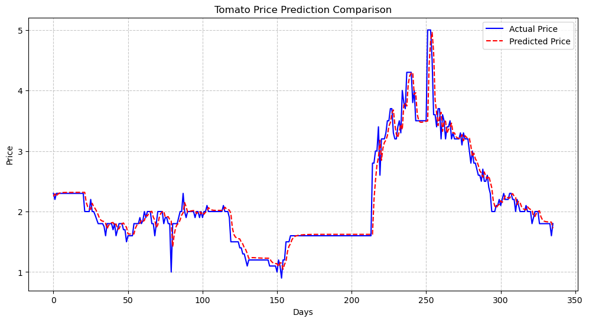

# 实验报告：基于LSTM模型的西红柿价格趋势分析

## 刘俸源 PB22111678

## 1. 引言
蔬菜价格预测对于农业生产管理、供应链优化和市场决策具有重要意义。本实验以西红柿为例，基于历年每日价格数据，使用长短期记忆网络（LSTM）模型进行价格预测，并在此基础上分别进行季度变化趋势和全年长期变化趋势分析，为实际应用提供参考依据。

---

## 2. 数据与预处理

本实验数据为西红柿在连续若干年内的每日价格数据，主要包括日期（`date`）和价格（`price`）字段。

数据预处理流程如下：
- 选取“西红柿”品类的数据；
- 按日期升序排列，并设定日期为索引；
- 以天为单位进行重采样，使用前向填充处理缺失值；
- 划分训练集（2024年1月1日之前）和测试集（2024年全年）；
- 使用`MinMaxScaler`对数据进行归一化处理。

---

## 3. 方法

### 3.1 LSTM模型构建

使用PyTorch框架搭建了一个两层的LSTM模型，模型结构如下：
- 输入层：输入特征为价格序列（1维特征）；
- LSTM层：2层堆叠，隐藏单元个数为64；
- 全连接层：输出预测的下一天价格。

损失函数使用均方误差（MSE），优化器采用Adam，学习率设为0.001，训练轮数为20轮。

### 3.2 序列生成方法

采用滑动窗口方法，将连续30天的价格作为输入特征，预测第31天的价格，构建训练集和测试集。

---

## 4. 结果

### 4.1 模型预测效果

在测试集（2024年）上，模型的预测性能指标如下：

| 指标 | 数值 |
|:---|:---|
| $R^2$ | **0.9379** |
| MSE | **0.0379** |

可以看到，模型能够较好地捕捉价格的变化趋势，但在局部波动区域存在一定预测误差。

---

### 4.2 趋势分析

#### （1）季度变化趋势

将2024年的实际价格和预测价格按季度（Q1、Q2、Q3、Q4）进行平均，得到季度均价变化趋势如下：

.png>)

| 季度 | 实际均价 | 预测均价 | 实际变化率 | 预测变化率 |
|:---|:---|:---|:---|:---|
| Q1 | 2.0041933 | 1.9706 | — | — |
| Q2 | 1.7248704 | 1.6857144 | -14.46% | -13.94% |
| Q3 | 2.1554837 | 2.1923914 | +30.06% | +24.96% |
| Q4 | 2.7428374 | 2.703261 | +23.30% | +27.25% |

**观察结果：**
- Q1至Q2价格略有下降；
- Q2至Q3继续小幅上升；
- Q3至Q4价格继续上升，表现出明显的季节性波动。

---

#### （2）长期变化趋势

使用30天滑动平均（Rolling Mean）平滑价格曲线，得到全年长期趋势变化如下图所示：

 with 30-Day Moving Average.png>)

全年价格变动百分比统计：

| 项目 | 数值 |
|:---|:---|
| 实际全年价格变化率 | **-21.74%** |
| 预测全年价格变化率 | **-23.45%** |

**全年趋势判定：**
- 实际趋势：下降
- 预测趋势：下降

---

## 5. 分析与讨论

1. **模型预测效果：**
   - LSTM能够基本捕捉到价格的长期走势和季度变化；
   - 但短期突变的价格波动预测准确率偏低，可能需要引入更多特征（如天气、节假日等）进一步优化。

2. **季度变化趋势：**
   - 季节性波动特征明显，尤其是秋季、冬季价格上涨，夏季下降，符合西红柿生产与供应特点；
   - 预测结果能够较准确反映季节性变化。

3. **长期变化趋势：**
   - 整体价格水平在2024年呈下降趋势；
   - 预测曲线与实际曲线基本一致，说明模型对长期趋势的预测能力较好。

---

## 6. 总结

本文基于每日价格数据，使用LSTM神经网络进行建模，完成了西红柿价格的预测与趋势分析。实验结果表明，LSTM在处理时间序列数据中具有较好的建模能力，能够有效捕捉价格的季度性变化与全年趋势。未来可以尝试引入更多外部特征数据，并探索更复杂的时序模型（如Transformer）以进一步提升预测性能。

---
