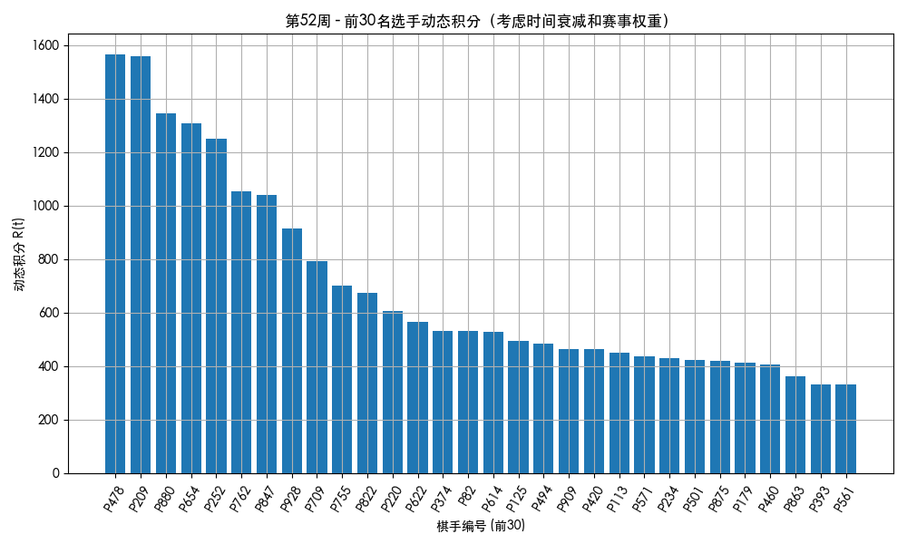
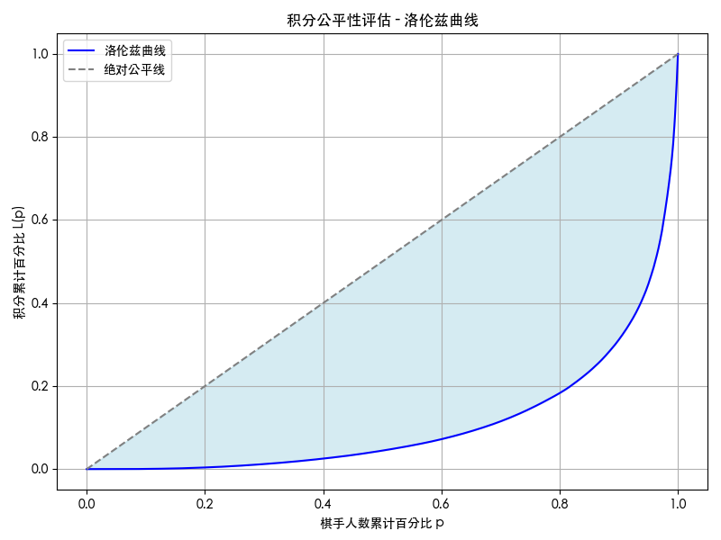

本文将从以下三个方面评估《象棋竞赛积分排名办法（试行）》(以下简称《方法》)：

1. 积分时效性与准确性: 是否真实反映棋手实时水平
   - 第十五条 积分排名累加运动员最近连续 52 周内积分最高的 10 项赛事积分。
   - 第十六条 每个自然年第一站比赛至最后一站比赛称为一个赛季。同一赛事前一赛季所获得的积分将被新赛季所获得积分滚动覆盖。

2. 系统公平性: 是否存在头部固化/底层晋升困难
   - 第十条 运动员年龄按照自然年计算。青少年运动员因年龄增长升入上一年龄组别的，现有积分按照 50%计入新的年龄组别。
   
3. 生态健康度: 是否能激励持续参赛、促进选手流动
   - 第十九条 若两位或多位运动员积分相同，则参加赛事更多者排名更高，若相同以单个最高赛事积分依次排序。


# 一、数学模型构建

**1. 动态积分评估模型**
采用时间序列分析法，建立选手积分变化函数：
$$
R(t) = \sum_{i=1}^{10} w_i S_i e^{-\lambda (t-t_i)}
$$
其中$w_i$为赛事级别权重（A级1.0，B1级0.8，B2级0.6，C级0.5，D级0.4，E级0.3），$S_i$为单次赛事积分，$\lambda$为衰减系数（取0.005对应52周半衰期）。**该模型用以量化积分时效性影响。**

**2. 公平性评价指标**
构建洛伦兹曲线与基尼系数：
$$
G = 1 - 2\int_{0}^{1} L(p)dp
$$
式中​L(p)​​表示积分累计百分比函数. 将选手按人数等分为n个区间, 计算每个分位点的积分累计占比,利用数值积分计算基尼系数:
   $$
   G = 1 - \sum_{i=1}^{n} (p_i - p_{i-1}) \times (L(p_i) + L(p_{i-1}))
   $$

- 若G=0.4，表示积分分布相对均衡
- 若G=0.6，说明前10\%选手垄断了大部分积分（需规则调整）

**3. 激励效果量化模型**
建立马尔可夫链状态转移矩阵：
$$
P = \begin{bmatrix}
p_{11} & p_{12} & \cdots \\
p_{21} & \ddots &  \\
\vdots &  & p_{nn}
\end{bmatrix}
$$
将棋手排名按百分比划分为5个状态：前10\%、10\%-30\%、30\%-50\%、50\%-80\%、后20\%。

求解稳态分布 $\pi P = \pi$. 若"前10\%→前10\%"概率>90\%，说明头部固化，需增加年轻棋手晋升通道。


# 二、数据准备

利用程序模拟出 1000 名棋手的参赛过程和积分演化过程，来应用上述模型检验《方法》。

定义每位棋手：

- 每周是否参赛

- 参赛的赛事级别（按概率）

- 该次比赛的成绩名次（通过能力值 + 随机性生成）

- 累积保存最近 52 周内最多 10 次积分

---

1. 定义模拟参数

```python
N_PLAYERS = 1000      # 总共模拟1000位棋手
N_WEEKS = 52          # 模拟52周（一年）
MAX_EVENTS = 10       # 动态积分最多考虑最近10场
```

---

2. 模拟棋手能力值

```python
player_strength = np.random.normal(loc=1500, scale=300, size=N_PLAYERS)
```

* 每位棋手的“实力”由一个正态分布模拟，平均值为1500，标准差为300


---

3. 定义赛事级别、权重、出现概率

```python
event_levels = {
    'A': 1500, 'B1': 1000, 'B2': 750, 'C': 500, 'D': 300, 'E': 100
}
level_weights = {'A': 1.0, 'B1': 0.8, 'B2': 0.6, 'C': 0.5, 'D': 0.4, 'E': 0.3}
level_probs = [0.01, 0.05, 0.1, 0.2, 0.3, 0.34]
```

* `event_levels`：每种等级比赛的“冠军基础分”，A 级最多，E 级最少。
* `level_weights`：动态积分时，不同等级赛事的“重要性权重”。
* `level_probs`：某一周中不同等级比赛出现的概率。例如：

  * A级比赛一周只有 1% 概率发生；
  * E级赛事则很常见，有 34% 的概率。

---

4. 名次得分比例表

```python
rank_score_table = {
    1: 1.0, 2: 0.65, 3: 0.39, 4: 0.215, 5: 0.15, 10: 0.09, 20: 0.045, 32: 0.025, 64: 0.01
}
```

* 用于决定某个名次能拿到的分数比例，例如：

  * 第1名拿100%
  * 第2名拿65%
  * 第10名拿9% 
* 没有具体名次的用最后一个对应值；例如第40名属于小于64的，就得0.01倍。

---

5. 得分比例函数

```python
def get_score_ratio(rank):
    for cutoff in sorted(rank_score_table):
        if rank <= cutoff:
            return rank_score_table[cutoff]
    return 0
```

* 输入某个名次 `rank`，返回对应的得分比例。
* 如果超出了所有设定的范围，比如第70名，返回 `0` 分。

---

6. 模拟棋手比赛过程

```python
player_events = defaultdict(list)
```

* 创建一个字典记录每位棋手的比赛记录，格式为：

  ```
  player_events[棋手ID] = [(得分, 周数, 等级), ...]
  ```

---

7. 主模拟循环（逐周进行）

```python
for week in range(N_WEEKS):  # 每周
    for level, prob in zip(event_levels, level_probs):  # 每个等级赛事
        if random.random() < prob:
            participants = np.random.choice(N_PLAYERS, size=random.randint(32, 128), replace=False)
```

* 对每一周，尝试为每个等级赛事生成一场比赛（是否真的举办由 `prob` 决定）。
* 如果随机数小于该级别的概率，则“这周举办该级别的赛事”。
* 比赛的参与人数随机设定在 32 到 128 之间。
* 参赛棋手从1000人中随机选出。

---

8. 模拟比赛排名

```python
            strength = player_strength[participants]
            ranking = participants[np.argsort(-strength + np.random.normal(0, 100, size=len(participants)))]
```

* 每个参赛棋手的实力加上一个随机误差（标准差为100），形成“比赛状态”。
* 以此对棋手进行排序，生成比赛排名（实力高 + 状态好 = 靠前名次）。

---

9. 计算每位参赛者得分 & 保存记录

```python
            for i, pid in enumerate(ranking):
                base_score = event_levels[level]
                ratio = get_score_ratio(i+1)
                score = base_score * ratio
                player_events[pid].append((score, week, level))
```

* 对每个参赛者，根据名次（`i+1`）计算得分比例。
* 然后：

  * `score = base_score * 得分比例`
  * 比如：C级比赛冠军 = 500 \* 1.0 = 500 分。
* 最后把这个结果 `(score, week, level)` 添加到该棋手的记录中。

---

# 三、模型验证

## 1. 动态积分评估模型

利用上述的选手积分变化函数：
$$
R(t) = \sum_{i=1}^{10} w_i S_i e^{-\lambda (t-t_i)}
$$

和模拟出的数据，得到计算所有棋手在最后一周（week 51）的动态积分:



## 2. 公平性评价指标  

利用模拟出的数据，做出洛伦兹曲线如下：



输出得到基尼系数基尼系数 G = 0.7810。

- 理论标准：

  - G < 0.3 极度公平

  - 0.3 < G < 0.4 相对公平

  - G ≈ 0.6 → 明显不公平

  - G > 0.7 → 垄断严重（积分制度失衡）

模拟结果中，G = 0.7810，表明积分集中程度极高，前10\%棋手垄断了大部分积分资源，形成“强者越强”的马太效应。


## 3. 激励效果量化模型

建立马尔可夫链状态转移矩阵：
$$
P = \begin{bmatrix}
p_{11} & p_{12} & \cdots \\
p_{21} & \ddots &  \\
\vdots &  & p_{nn}
\end{bmatrix}
$$
将棋手排名按百分比划分为5个状态：

| 状态编号 | 区间      | 说明   |
| ---- | ------- | ---- |
| 0    | 前10%    | 头部选手 |
| 1    | 10%-30% | 精英选手 |
| 2    | 30%-50% | 中等选手 |
| 3    | 50%-80% | 普通选手 |
| 4    | 后20%    | 边缘选手 |


具体步骤如下:

- Step 1：按照季度重新计算每个棋手的动态积分
- Step 2：在每个季度根据积分给棋手划分“状态”
- Step 3：统计状态转移次数，计算转移概率矩阵 
- Step 4：求马尔可夫稳态分布，分析是否“头部固化”

得到输出如下:

```markdown
马尔可夫转移概率矩阵 P：
[[0.3   0.237 0.113 0.237 0.113]
 [0.118 0.205 0.217 0.303 0.157]
 [0.065 0.202 0.22  0.343 0.17 ]
 [0.067 0.193 0.193 0.423 0.123]
 [0.067 0.185 0.217 0.1   0.432]]

稳态分布 π（长远棋手分布）：
状态0（Top 10%）: π = 0.100
状态1（10-30%）: π = 0.200
状态2（30-50%）: π = 0.200
状态3（50-80%）: π = 0.300
状态4（Bottom 20%）: π = 0.200

```

上述结果看出: 

- **Top10\%保留率仅为30\%，表明选手具备“向上流动”的机会，非固化**；

- 状态 3 和 4 也有向前转移的可能性，说明机制具有生态健康度和激励活性；


# 四、改进建议

## 1. 晋升通道建设
- **问题**：基尼系数0.78显示底层选手晋升困难
- **方案**：
  - **黑马赛机制**：每赛季举办两次仅限积分后50%选手参加的专属赛事（B2级权重），冠军直接获得当年A级赛参赛资格
  - **跨级挑战奖励**：首次进入前30%排名时给予30%积分加成（公式：$\Delta S=原积分×\max(0,0.3×(1-当前排名百分比/30\%))$）

#### 2. **赛事参与激励机制**
- **问题**：现行规则对低活跃度选手约束不足
- **方案**：
  - **动态参赛系数**：以最近13周参赛次数为基准，计算活跃度调整因子（公式：$α=1+\ln(1+周参赛次数)/5$）
  - **阶梯奖励**：年度参赛超过15场者，第16场起每场额外获取5%积分加成（上限30%）
