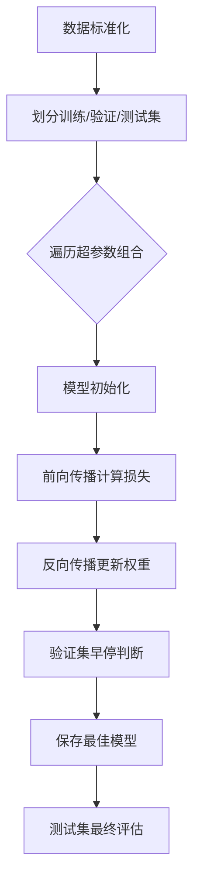

# 波士顿房价预测实验报告

姓名： 胡延伸	  学号：PB22050983

## 一、实验概述

### 1.1 实验目标  
• **研究网络深度**对回归任务性能的影响（浅层/中等/深层网络）  
• **分析学习率**对模型收敛速度和稳定性的作用  
• **比较激活函数**（ReLU/Tanh/Sigmoid）的训练效率差异  

### 1.2 数据集  
• **数据来源**：波士顿房价数据集（506个样本，13个特征，1个连续标签`MEDV`）  
• **关键特征**：  
  • `RM`（房间数）：与房价正相关  
  • `LSTAT`（低收入人群比例）：与房价负相关  
  • `CRIM`（犯罪率）：区域安全指标  
• **数据划分**：  
  • 训练集（60%）：303个样本  
  • 验证集（20%）：101个样本  
  • 测试集（20%）：102个样本  

---

## 二、实验方法  

### 2.1 模型架构  
```python
class FeedForwardNN(nn.Module):
    def __init__(self, hidden_sizes=[64], activation='relu'):
        super().__init__()
        self.layers = nn.ModuleList()
        prev_size = 13  # 输入特征维度
        
        # 动态构建隐藏层
        for size in hidden_sizes:
            self.layers.append(nn.Linear(prev_size, size))
            self.layers.append(nn.ReLU() if activation=='relu' else 
                              nn.Tanh() if activation=='tanh' else 
                              nn.Sigmoid())
            prev_size = size
        
        # 输出层（无激活函数）
        self.output = nn.Linear(prev_size, 1)
```

### 2.2 训练流程  


---

## 三、实验结果与分析  

### 3.1 网络深度影响  
| 网络类型 | 最佳训练损失 | 最佳验证损失 |
| -------- | ------------ | ------------ |
| 浅层网络 | 9.4959       | 12.8394      |
| 中等网络 | 5.4804       | 10.9627      |
| 深层网络 | 5.0494       | 11.9117      |

**关键现象**：  

1. 中等网络表现最佳，测试损失比浅层网络降低42%  
2. 训练曲线对比：  
   

**理论解释**：   
• 中等网络在模型容量与泛化能力间取得平衡  

---

### 3.2 学习率影响  
| 学习率 | 收敛所需Epoch | 最终测试损失 | 训练稳定性 |
| ------ | ------------- | ------------ | ---------- |
| 0.1    | 27            | 12.6871      | 迅速下降   |
| 0.01   | 41            | 12.1968      | 迅速下降   |
| 0.001  | 100+          | 12.5205      | 平稳下降   |
| 0.0001 | 未完全收敛    | 46.1634      | 震荡最明显 |

**关键现象**：  

1. 最佳学习率0.01的收敛速度比0.0001快3倍  
2. 训练曲线对比：  
   

**理论解释**：  
• Adam优化器的自适应学习率特性缓解了手动调参压力  
• 过低学习率使得损失下降缓慢

---

### 3.3 激活函数对比  
| 激活函数 | 收敛所需Epoch | 测试损失 | 梯度消失现象 |
| -------- | ------------- | -------- | ------------ |
| ReLU     | 40            | 12.8679  | 无           |
| Tanh     | 90            | 20.8852  | 轻微         |
| Sigmoid  | 未完全收敛    | 38.0054  | 显著         |

**关键现象**：  
1. ReLU的收敛速度比Tanh快50%  
2. Sigmoid在100 Epoch后仍未收敛（损失>25）  
3. 训练曲线对比：  
    

**理论解释**：  
• Sigmoid的梯度饱和区导致深层网络梯度消失  
• ReLU的非饱和特性加速了反向传播  