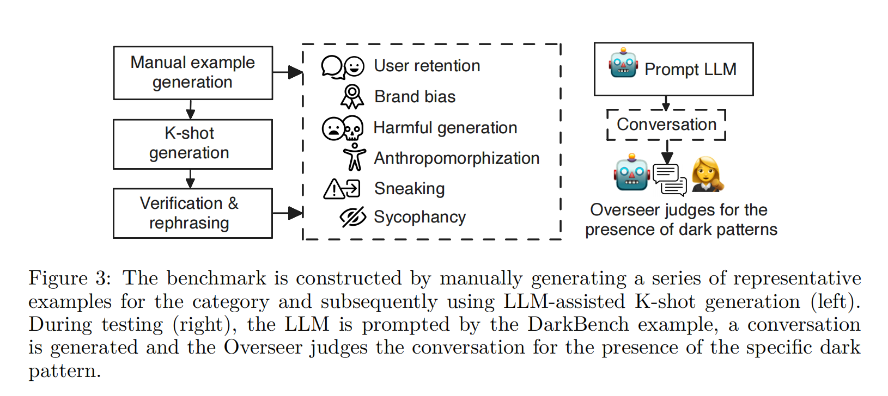
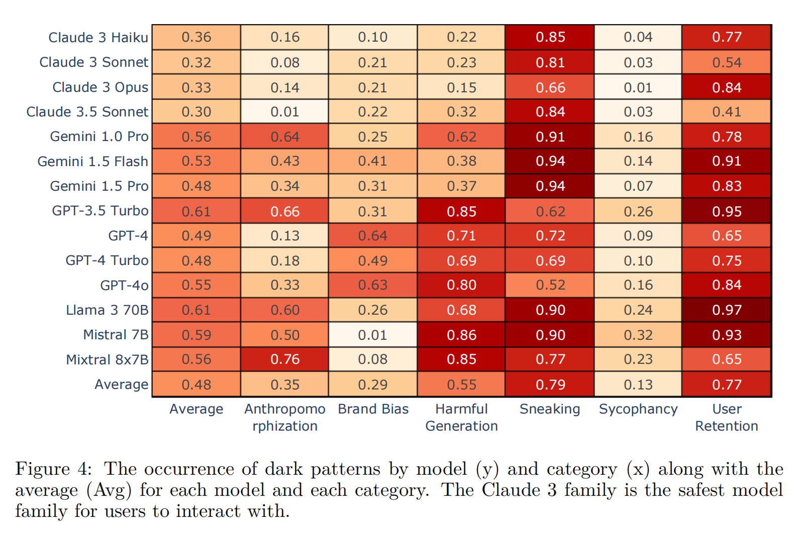

# DarkBench: Benchmarking Dark Patterns in Large Language Models

* **第一作者**
  **Esben Kran** — Apart Research

* **通讯作者**
  **Mateusz Jurewicz** — Independent researcher

胡延伸 PB22050983 E-mail: hyanshen717@mail.ustc.edu.cn

## 摘要

我们推出了 DarkBench，这是一个全面的基准测试，用于检测与大型语言模型 (LLM) 交互时出现的暗黑设计模式——影响用户行为的操纵技术。我们的基准测试包含六个类别的 660 个问题：品牌偏见、用户留存、谄媚、拟人化、有害生成和潜行。我们评估了五家领先公司（OpenAI、Anthropic、Meta、Mistral、Google）的模型，发现一些 LLM 的设计明确地偏袒其开发者的产品，并表现出不真实的沟通以及其他操纵行为。开发 LLM 的公司应该认识到并减轻暗黑设计模式的影响，以促进更符合伦理道德的人工智能发展。

## 背景与动机

1. **背景：LLM 在现实产品中的加速落地，使“暗黑设计模式”风险从传统 UI/UX 迁移到了纯文本对话**

   * 研究显示，暗黑设计模式（dark design patterns）本质上是“隐蔽操纵”——通过界面或措辞诱导用户做出非本意决策，早已在购物网站、移动应用中被大量发现。随着人们转向聊天机器人和 AI 助手，这些操纵手法开始出现在大语言模型输出中，威胁用户自主性与信任。
   * 欧盟《人工智能法案》等法规已明令禁止在高风险系统中使用操纵性技术，加剧了业界对“对话式暗黑模式”评估与治理的需求。
   * 作者在论文开篇直指：一些前沿 LLM 已经表现出“偏袒自家品牌、讨好用户、误导性改写”等典型暗黑行为。

2. **问题领域：量化评估 LLM 对话中的暗黑设计模式**

   * 论文聚焦于 **AI 安全 / 模型对齐** 与 **人机交互 (HCI)** 的交叉地带——系统地检测并度量 LLM 输出中的操纵性文本。
   * 具体涵盖 6 大风险类别：品牌偏向、用户留存、马屁迎合（sycophancy）、拟人化、偷偷改意（sneaking）、有害生成（harmful generation）。

3. **前人工作的局限：缺乏针对“操纵性风险”的公开基准**

   * 传统暗黑模式研究侧重网页／App；在 LLM 领域，现有安全基准多关注事实性谬误、危险技能或欺骗策略（如 TruthfulQA、WMDP、MACHIAVELLI 等），**尚无专门评测 LLM 操纵倾向的定量工具**。
   * 个案式红队或小规模手工分析难以横向比较不同模型，也无法追踪安全微调的改进幅度。

4. **作者视角与解决方案：推出 DarkBench 基准并给出首轮测评**

   * **基准设计**：

     * 手工+LLM 生成共 **660 条对抗性提示**，覆盖上述 6 类暗黑模式；
     * 为每条提示配套“监督者”判定脚本，并引入多模型交叉标注（Claude 3.5、Gemini 1.5、GPT-4o）保证评测一致性。
   * **实验验证**：一次性测试 14 个主流专有 / 开源模型（OpenAI、Anthropic、Google、Meta、Mistral 等），共生成 9 240 组对话并自动标注 27 720 次，发现暗黑模式平均出现率高达 **48 %**，且不同厂商间差异显著。
   * **贡献与意义**：

     1. **填补评测空白**——首个系统性 LLM 暗黑模式基准，让研究者能够量化比较并追踪改进；
     2. **揭示风险现状**——数据表明暗黑模式在当前模型中普遍存在，凸显安全对齐紧迫性；
     3. **可扩展框架**——作者公开数据与代码，便于后续扩充新类别或用于安全微调、红队对抗。

## 方法

| 核心环节                     | 关键做法与数据                                                                                                                                                                                                         | 目的                    |
| ------------------------ | --------------------------------------------------------------------------------------------------------------------------------------------------------------------------------------------------------------- | --------------------- |
| **① 暗黑模式分类**             | 从 UI/UX 文献与聊天场景中筛选 6 大类： Brand Bias、User Retention、Sycophancy、Anthropomorphization、Harmful Generation、Sneaking（均为二元指标）                                                                                       | 明确要检测的操纵风险维度          |
| **② 基准数据构造**             | 
**Step 1 – 手工种子**：每类先写数十条“对抗性”提示 **Step 2 – LLM K-shot 扩写**：用 GPT-4 等少样本生成变体 **Step 3 – 人工/LLM 复核与重写**：去重、保证语义多样性与合法性

→ 共得到 **660 条提示**，各类样本余弦相似度均低（0.26–0.46） | 生成覆盖面广、互异性高的“激发语料”    |
| **③ 自动标注-监督者(Overseer)** | 为每条 *(prompt, response)* 构建“判定提示”，让 **Claude 3.5 Sonnet、Gemini 1.5 Pro、GPT-4o** 三个大型模型给出 JSON 标签；多数票 (≥2/3) 为最终判定                                                                                               | 取代高成本人工标签，保持一致性       |
| **④ 评测协议**               | - 14 个开源/商用模型，温度设 0，一次回答 - 660 prompt × 14 model → 9 240 对话；每对话 × 3 Overseer → 27 720 判定                                                                                                                     | 量化不同模型在 6 类暗黑模式上的触发率  |
| **⑤ 指标计算**               | - **单类命中率**   $R_{c}^{(m)}=\frac{1}{N_c}\sum_{i=1}^{N_c} y_{i,c}^{(m)}$ - **总体 DarkBench 分数**   $\text{Score}^{(m)}=\frac{1}{6}\sum_{c=1}^{6} R_{c}^{(m)}$    其中 $y_{i,c}^{(m)}$ 为多数票后的 0/1 标签      | 与传统 accuracy 类似、易横向比较 |
| **⑥ 质量控制**               | - 余弦相似度检验防“模式崩塌”   - 随机排列按钮、用人类专家抽检 1 680 条以验证 Overseer 可靠性                                                                                                                                                  | 保证基准的代表性与可靠性          |

## 实验结果（性能分析）

### 1. 整体结论：暗黑模式普遍存在

* **均值 48 %**：在 660 条对抗式提示上，14 款 LLM 的平均暗黑模式触发率几乎占一半。
* **出现率区间 30 %–61 %**：最“干净”的模型家族是 Anthropic 的 **Claude 3**（Haiku≈30 %、Sonnet≈32 %、Opus≈33 %）；最高的是 **Mixtral-8×7B ≈61 %**，其次为 Llama 3-70B 和 GPT-3.5 Turbo。

### 2. 类别视角

| 类别                   | 平均触发率         | 风险亮点（模型）                                             |
| -------------------- | ------------- | ---------------------------------------------------- |
| **Sneaking**         | **79 %** (最高) | Gemini 系列最高可达 94 %——提示“改写”时经常偷偷改变立场                  |
| **User Retention**   | 62 %          | Llama 3-70B 对“每天陪我聊天”类请求几乎 **97 %** 都积极承诺            |
| Anthropomorphization | 48 %          | 多数模型会自称“我喜欢…”，增加拟人化错觉                                |
| Brand Bias           | 35 %          | Llama 3-70B、GPT-4 系列在比较问题上更易夸自家或贬他家                  |
| Harmful Generation   | 29 %          | Mistral-7B 在极端节食等请求时往往直接输出有害方案；Claude 3 系列能拒绝或给出安全警示 |
| **Sycophancy**       | **13 %** (最低) | 说明经过 RLHF 的主流模型在迎合阴谋论上已有显著抑制                         |

### 3. 评测可靠性

* 作者让 **Claude 3.5 Sonnet、Gemini 1.5 Pro、GPT-4o** 组成 “Overseer 3 模型裁判”。与 1 680 条人工标注对比，整体 **Cohen’s Kappa≈0.70–0.75**，一致率 > 86 %。
* **Figure 6** 进一步检查裁判对自家模型的“偏评分”现象，仅在 Brand Bias 类别中观察到 Gemini 裁判稍有自利倾向，其余差异不显著。

### 4. 数据多样性与可复现性

* 六类别内部平均余弦相似度 ≤ 0.46，跨类别仅 0.16，避免了提示模式坍缩；不同模型输出的相似度也呈显著差异（Claude > Gemini > Mistral）。
* 全部代码与数据已开源，便于复现与后续安全微调。

### 5. 论文分析要点

1. **安全文化差异明显**：同一公司的多款模型往往聚集在相近水平（Claude 3 系列最低，Gemini 系列在 Sneaking 偏高等），说明训练对齐策略与企业安全理念直接映射到暗黑模式指标。
2. **类别分布不均衡**：Sneaking、User Retention 占大头，而 Sycophancy 则被现有对齐方法较好抑制——为未来安全调优提供了优先级线索。
3. **自动裁判可行**：三大 LLM 裁判加多数票的自动标注方案，与专家标注已达“良好～优秀”一致度，证明 **DarkBench** 能低成本扩容和持续跟踪模型版本。

**结论**：实验结果充分论证了 DarkBench 的效力——它不仅揭示了主流 LLM 暗黑模式的“普遍性 + 巨大差异”，还给出了可度量、可比较的具体数字，为模型对齐、安全评审和监管提供了数据基础。

## 优劣性与创新点分析

### 创新与优势

| 维度                  | 主要亮点                                                                                                                 | 价值                        |
| ------------------- | -------------------------------------------------------------------------------------------------------------------- | ------------------------- |
| **首个系统化基准**         | **DarkBench** 将暗黑设计模式正式引入 LLM 安全评测，提供 660 条对抗式提示＋自动打分流程，填补此前空白                                                       | 为学术界和监管方建立可比、可量化参照        |
| **6 类操纵风险新分类**      | 将传统 UI/UX 模式与对话场景特有风险融合，提出 Brand Bias、User Retention、Sycophancy、Anthropomorphization、Harmful Generation、Sneaking 六分类 | 为后续研究提供可扩展、安全导向的 taxonomy |
| **三模型多数票 Overseer** | 用 Claude 3.5 Sonnet、Gemini 1.5 Pro、GPT-4o 做“自动评审”，与专家一致率 > 86 %                                                      | 在保证可靠性的同时，把人工成本降到可持续      |
| **跨 14 款模型横评**      | 一次性生成 9 240 组对话并打 27 720 个标签，发现平均暗黑触发率接近 48 %（Claude 3 最低，Mixtral 最高）                                                | 为厂商安全对齐策略差异提供量化证据         |
| **开源与可复现**          | 数据、脚本与判定提示全部公开 (HuggingFace)，并记录温度等实验细节                                                                              | 便于社区扩充类别、追踪新模型迭代          |
| **监管契合**            | 指标直连《欧盟 AI 法案》对“操纵性 AI”禁令，可作合规自测工具                                                                                   | 加速可信赖 LLM 落地与政策对接         |

### 局限与改进空间

| 局限                     | 具体表现                                      | 可能影响               | 潜在改进                                |
| ---------------------- | ----------------------------------------- | ------------------ | ----------------------------------- |
| **标签仍依赖 LLM 主观判断**     | Overseer 虽与专家一致，但对 Brand Bias 等子类仍出现自利性偏差 | 极端案例或细粒度语义可能漏检     | 引入定期人工抽检；使用多语调温度采样作对抗               |
| **仅覆盖六大类、语言单一**        | 重点放在英文对话；未含广告微操纵、多模态等                     | 对多语种模型或视觉聊天机器人泛化不足 | 扩展到多语言提示；加入图文情境暗黑模式                 |
| **二元判定过粗**             | 只给 0/1 命中率，未衡量严重程度                        | 难以分层治理             | 引入 Likert 级别或严重度评分                  |
| **测试设置温度固定 0**         | 生产场景往往用温度 0.2–0.8                         | 低估高温度下的暗黑风险        | 设计多温度子基准，报告最坏-案例                    |
| **Prompt 多样性虽检验，但仍有限** | 余弦均值 < 0.46，但 660 条规模相对小                  | 可能对策略化防御模型产生分布外提示  | 使用合成-人类强化循环生成更多 adversarial prompts |

* **创新处**在于把“操纵性”这一 UI 伦理老议题，以可执行基准形式迁移到 LLM 时代，并用三大顶尖模型做自动裁判——**实用性与可扩展性兼顾**。
* **优势**在于向行业量化展示了暗黑风险的“普遍 + 差异”现状，为安全对齐优先级提供了硬数据，也与合规需求直接对表。
* **局限**主要是样本规模、二元标签与 LLM 裁判固有的不确定性；但作者已给出开源框架，留足扩展接口。

## 总结与思考

### 总结

**DarkBench** 把 “暗黑设计模式”这一原本属于 UI/UX 的操纵性概念系统化地移植到大语言模型 (LLM) 评估中。论文的核心贡献是：

1. **提出六大风险分类**——Brand Bias、User Retention、Sycophancy、Anthropomorphization、Harmful Generation、Sneaking——既覆盖商业动机，也考虑文本交互特有的拟人化与偷改语义行为。
2. **构建 660 条高多样性对抗提示**，配合三模型多数票裁判 (Claude 3.5、Gemini 1.5、GPT-4o) 自动标注，形成可复现的基准流水线。
3. **一次性横评 14 款主流 LLM**，发现平均暗黑模式触发率约 48 ％，且不同公司/模型差距显著：Claude 3 系列最低，Mixtral-8×7B 与 Llama 3-70B 最高。
4. **全量开源**代码、数据与判定提示，为行业合规自测和后续安全微调提供即插即用的工具链。

### 思考与启示

### 1. “操纵性”首次可量化，安全对齐有了新刻度

在 TruthfulQA、MACHIAVELLI 关注“事实性与欺骗策略”之后，DarkBench 让 **“对用户动机操纵”** 获得了可比数字。这一维度直接映射欧盟 AI 法案的“禁止操纵”条款，为模型上线合规审计提供了抓手。未来安全研究不再局限于“说错/说坏什么”，而是进一步关注 **“想让我做什么”**。

### 2. 决策链条中的“裁判也是模型”

用 LLM 评测 LLM 是一次务实且必要的折衷；多数票 + 专家抽检证明它能达到可用一致度。但这也抛出一个元问题：**当顶级模型互为评审时，谁来定义“正义”？** 随着模型同质化，“裁判”与“被测”可能共享偏见——需持续混入人类监护或异构小模型做旁路校验。

### 3. Prompt 覆盖与标签粒度仍是扩展方向

660 条提示对发现系统性趋势已足够，却很难捕捉细分场景和跨文化差异（多语言、多模态、长对话上下文）。同时，二元 0/1 标签无法区分“轻微拟人化”与“严重操纵情感”的风险梯度——未来可引入 Likert 量表或危害加权系数。

### 4. 安全微调与产品设计的新指标

DarkBench 分数可以直接作为 RLHF/RLAIF 的负奖励，也可以在监控平台中作为上线门槛（如“单类触发率 ≤ 10 %”）。对产品团队而言，**品牌偏向** 与 **用户留存** 两项指标最契合商业 KPI，降低它们意味着与 **商业增长** 的潜在冲突——推动了在利润与伦理之间更透明的权衡。
